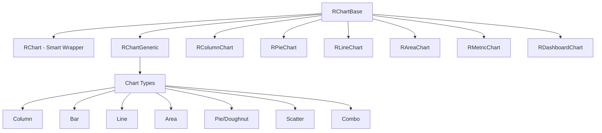

# RR.Blazor Smart Chart Architecture (Enterprise 2025)

## Overview

This document outlines the architecture for a world-class, enterprise-grade chart system in RR.Blazor following the established smart component patterns. The system provides zero-configuration charts with progressive enhancement capabilities, optimized for modern 2025 enterprise requirements.

## Architecture Philosophy

### Core Principles
1. **Smart Detection**: Zero-config charts that automatically detect data patterns and choose optimal visualization
2. **Progressive Enhancement**: Start simple, add complexity as needed
3. **Container-Agnostic**: Charts never include protective styling or context assumptions
4. **Onion Architecture**: Respect dependency direction - inner layers define contracts
5. **Enterprise Performance**: Handle 10,000+ data points with smooth animations

### Smart Component Pattern
Following the established RR.Blazor pattern from `RForm` → `RFormGeneric<T>`, charts use:
- `RChart` - Smart wrapper with automatic type detection
- `RChartGeneric<T>` - Strongly-typed implementation
- `RColumnChart`, `RPieChart`, `RLineChart`, `RAreaChart` - Specialized implementations

## Component Hierarchy



## Base Chart Architecture

### RChartBase (Abstract Foundation)
```csharp
public abstract class RChartBase : ComponentBase
{
    // Core Parameters
    [Parameter] public string? Title { get; set; }
    [Parameter] public string? Subtitle { get; set; }
    [Parameter] public string? Icon { get; set; }
    [Parameter] public ChartSize Size { get; set; } = ChartSize.Medium;
    [Parameter] public ChartVariant Variant { get; set; } = ChartVariant.Default;
    [Parameter] public ComponentDensity Density { get; set; } = ComponentDensity.Normal;
    
    // Loading & States
    [Parameter] public bool Loading { get; set; }
    [Parameter] public string? LoadingText { get; set; }
    [Parameter] public bool Empty { get; set; }
    [Parameter] public string? EmptyText { get; set; }
    [Parameter] public string? EmptyIcon { get; set; } = "analytics_off";
    
    // Accessibility
    [Parameter] public string? AriaLabel { get; set; }
    [Parameter] public int TabIndex { get; set; } = 0;
    [Parameter] public string? Description { get; set; }
    
    // Interaction
    [Parameter] public EventCallback<ChartClickEventArgs> OnClick { get; set; }
    [Parameter] public EventCallback<ChartHoverEventArgs> OnHover { get; set; }
    [Parameter] public bool Interactive { get; set; } = true;
    
    // Export & Actions
    [Parameter] public bool ExportEnabled { get; set; }
    [Parameter] public List<ChartExportFormat> ExportFormats { get; set; } = new() { ChartExportFormat.PNG, ChartExportFormat.SVG, ChartExportFormat.CSV };
    [Parameter] public EventCallback<ChartExportEventArgs> OnExport { get; set; }
    
    // Layout & Appearance
    [Parameter] public bool ShowLegend { get; set; } = true;
    [Parameter] public LegendPosition LegendPosition { get; set; } = LegendPosition.Bottom;
    [Parameter] public bool ShowGrid { get; set; } = true;
    [Parameter] public bool ShowAxes { get; set; } = true;
    [Parameter] public bool ShowTooltips { get; set; } = true;
    [Parameter] public bool ShowLabels { get; set; }
    [Parameter] public bool ShowValues { get; set; }
    
    // Animation & Performance
    [Parameter] public bool AnimationsEnabled { get; set; } = true;
    [Parameter] public int AnimationDuration { get; set; } = 750;
    [Parameter] public AnimationEasing AnimationEasing { get; set; } = AnimationEasing.EaseInOut;
    [Parameter] public bool VirtualizationEnabled { get; set; }
    [Parameter] public int VirtualizationThreshold { get; set; } = 1000;
    
    // Theming
    [Parameter] public ChartTheme Theme { get; set; } = ChartTheme.Auto;
    [Parameter] public List<string> ColorPalette { get; set; } = new();
    [Parameter] public Dictionary<string, object> CustomTheme { get; set; } = new();
    
    // Real-time Data
    [Parameter] public bool RealTimeEnabled { get; set; }
    [Parameter] public TimeSpan RealTimeInterval { get; set; } = TimeSpan.FromSeconds(5);
    [Parameter] public EventCallback OnRealTimeUpdate { get; set; }
    
    // Content Areas
    [Parameter] public RenderFragment? HeaderContent { get; set; }
    [Parameter] public RenderFragment? FooterContent { get; set; }
    [Parameter] public RenderFragment? ToolbarContent { get; set; }
    [Parameter] public RenderFragment? ChildContent { get; set; }
}
```

### Smart Chart Wrapper Pattern
```csharp
public class RChart : RChartBase
{
    [Parameter] public object? Data { get; set; }
    [Parameter] public ChartType? Type { get; set; } // Optional override
    
    protected override void BuildRenderTree(RenderTreeBuilder builder)
    {
        if (Data == null)
        {
            RenderEmptyState(builder);
            return;
        }

        var detectedType = Type ?? DetectChartType(Data);
        var dataType = GetDataType(Data);
        
        // Create appropriate generic chart component
        var genericChartType = detectedType switch
        {
            ChartType.Column => typeof(RColumnChart<>).MakeGenericType(dataType),
            ChartType.Line => typeof(RLineChart<>).MakeGenericType(dataType),
            ChartType.Pie => typeof(RPieChart<>).MakeGenericType(dataType),
            ChartType.Area => typeof(RAreaChart<>).MakeGenericType(dataType),
            _ => typeof(RChartGeneric<>).MakeGenericType(dataType)
        };
        
        builder.OpenComponent(0, genericChartType);
        ForwardAllParameters(builder);
        builder.CloseComponent();
    }
    
    private ChartType DetectChartType(object data)
    {
        // Smart detection based on data characteristics
        var analysis = AnalyzeData(data);
        
        return analysis switch
        {
            { IsCategorical: true, SeriesCount: 1 } => ChartType.Column,
            { IsTimeSeries: true } => ChartType.Line,
            { IsPart of Whole: true } => ChartType.Pie,
            { IsMultiSeries: true, IsTimeSeries: true } => ChartType.Area,
            _ => ChartType.Column
        };
    }
}
```

## Specialized Chart Components

### 1. RColumnChart - Zero Config Column/Bar Charts
```razor
@inherits RChartBase

<!-- Usage: <RColumnChart Data="@salesData" Title="Monthly Sales" /> -->

<div class="@ChartClasses">
    <RChartHeader Title="@Title" 
                  Subtitle="@Subtitle" 
                  Icon="@(Icon ?? "bar_chart")"
                  ShowExport="@ExportEnabled" />
    
    <div class="chart-container @ContainerClasses" 
         role="img" 
         aria-label="@EffectiveAriaLabel"
         tabindex="@TabIndex">
         
        <canvas @ref="ChartCanvas" 
                id="@ComponentId"
                class="chart-canvas"></canvas>
                
        @if (ShowLegend)
        {
            <div class="chart-legend @LegendClasses">
                <!-- Auto-generated legend -->
            </div>
        }
    </div>
    
    @if (FooterContent != null)
    {
        <div class="chart-footer">
            @FooterContent
        </div>
    }
</div>

@code {
    [Parameter] public IEnumerable<ChartDataPoint> Data { get; set; } = new List<ChartDataPoint>();
    [Parameter] public bool Horizontal { get; set; }
    [Parameter] public bool Stacked { get; set; }
    [Parameter] public ColumnChartStyle Style { get; set; } = ColumnChartStyle.Grouped;
    
    // Automatic CSS class generation using established patterns
    private string ChartClasses => CssBuilder.Default()
        .AddClass("chart-container")
        .AddClass($"chart-{(Horizontal ? "bar" : "column")}")
        .AddClass($"chart-{Size.ToString().ToLower()}")
        .AddClass($"chart-{Variant.ToString().ToLower()}")
        .AddClass($"density-{Density.ToString().ToLower()}")
        .AddClass("chart-loading", Loading)
        .AddClass("chart-empty", Empty)
        .Build();
}
```

### 2. RPieChart - Smart Pie/Doughnut Charts
```razor
@inherits RChartBase

<!-- Usage: <RPieChart Data="@marketShare" ShowValues="true" /> -->

<div class="@ChartClasses">
    <RChartHeader Title="@Title" Icon="@(Icon ?? "pie_chart")" />
    
    <div class="pie-chart-container" role="img" aria-label="@EffectiveAriaLabel">
        <svg @ref="ChartSvg" class="pie-chart-svg">
            <!-- Auto-generated pie slices -->
        </svg>
        
        @if (ShowCenterValue && CenterValue != null)
        {
            <div class="pie-chart-center">
                <span class="pie-chart-center-value">@CenterValue</span>
                <span class="pie-chart-center-label">@CenterLabel</span>
            </div>
        }
    </div>
</div>

@code {
    [Parameter] public IEnumerable<ChartDataPoint> Data { get; set; } = new List<ChartDataPoint>();
    [Parameter] public bool Doughnut { get; set; } = true;
    [Parameter] public double InnerRadius { get; set; } = 0.6;
    [Parameter] public bool ShowPercentages { get; set; } = true;
    [Parameter] public bool ShowCenterValue { get; set; }
    [Parameter] public string? CenterValue { get; set; }
    [Parameter] public string? CenterLabel { get; set; }
    [Parameter] public int MinSliceAngle { get; set; } = 3; // Minimum degrees for visibility
}
```

### 3. RLineChart - Time Series & Trend Analysis
```razor
@inherits RChartBase

<!-- Usage: <RLineChart Series="@temperatureData" RealTimeEnabled="true" /> -->

<div class="@ChartClasses">
    <RChartHeader Title="@Title" Icon="@(Icon ?? "show_chart")" />
    
    <div class="line-chart-container" role="img" aria-label="@EffectiveAriaLabel">
        <canvas @ref="ChartCanvas" class="line-chart-canvas"></canvas>
        
        @if (ShowCrosshair)
        {
            <div class="line-chart-crosshair"></div>
        }
    </div>
    
    @if (ShowZoomControls)
    {
        <div class="chart-zoom-controls">
            <RButton Icon="zoom_in" Size="ButtonSize.Small" OnClick="ZoomIn" />
            <RButton Icon="zoom_out" Size="ButtonSize.Small" OnClick="ZoomOut" />
            <RButton Icon="zoom_out_map" Size="ButtonSize.Small" OnClick="ResetZoom" />
        </div>
    }
</div>

@code {
    [Parameter] public IEnumerable<ChartSeries> Series { get; set; } = new List<ChartSeries>();
    [Parameter] public bool Smooth { get; set; } = true;
    [Parameter] public bool ShowPoints { get; set; } = true;
    [Parameter] public bool ShowArea { get; set; }
    [Parameter] public bool ShowCrosshair { get; set; } = true;
    [Parameter] public bool ZoomEnabled { get; set; } = true;
    [Parameter] public bool PanEnabled { get; set; } = true;
    [Parameter] public bool ShowZoomControls { get; set; }
    [Parameter] public TimeSpan? TimeWindow { get; set; } // For real-time scrolling
}
```

## Data Models & Type System

### Core Data Structures
```csharp
// Universal data point for all chart types
public record ChartDataPoint(string Label, decimal Value, string? Category = null)
{
    public string? Color { get; init; }
    public string? Description { get; init; }
    public Dictionary<string, object> Metadata { get; init; } = new();
    public bool Highlighted { get; init; }
    public string? Url { get; init; } // For drill-down
}

// Multi-series data for line/area charts
public record ChartSeries(string Name, IEnumerable<ChartDataPoint> Data)
{
    public string? Color { get; init; }
    public LineStyle LineStyle { get; init; } = LineStyle.Solid;
    public int LineWidth { get; init; } = 2;
    public bool Visible { get; init; } = true;
    public string? Unit { get; init; }
}

// Smart data analysis result
public record ChartDataAnalysis
{
    public bool IsCategorical { get; init; }
    public bool IsTimeSeries { get; init; }
    public bool IsNumeric { get; init; }
    public bool IsMultiSeries { get; init; }
    public bool IsPartOfWhole { get; init; }
    public int SeriesCount { get; init; }
    public int DataPointCount { get; init; }
    public Range<decimal> ValueRange { get; init; }
    public TimeSpan? TimeSpan { get; init; }
    public List<string> Categories { get; init; } = new();
    public ChartType RecommendedType { get; init; }
}
```

### Enums & Configuration
```csharp
public enum ChartType
{
    Auto,
    Column,
    Bar,
    Line,
    Area,
    Pie,
    Doughnut,
    Scatter,
    Combo,
    Gauge,
    Funnel,
    Heatmap
}

public enum ChartSize
{
    ExtraSmall,  // 200px
    Small,       // 300px 
    Medium,      // 400px
    Large,       // 600px
    ExtraLarge,  // 800px
    Full         // 100% container width
}

public enum ChartVariant
{
    Default,
    Minimal,     // No grid, reduced chrome
    Glass,       // Glassmorphism styling
    Elevated,    // Drop shadows
    Outlined,    // Border focus
    Gradient,    // Gradient backgrounds
    Professional // Enterprise styling
}

public enum AnimationEasing
{
    Linear,
    EaseIn,
    EaseOut,
    EaseInOut,
    Bounce,
    Elastic
}
```

## JavaScript Architecture

### Modern ES6 Module System
```javascript
// /wwwroot/js/charts/chart-core.js
class RRChartEngine {
    constructor() {
        this.charts = new Map();
        this.resizeObserver = new ResizeObserver(this.handleResize.bind(this));
        this.intersectionObserver = new IntersectionObserver(this.handleVisibility.bind(this));
        this.rafId = null;
        this.isDarkMode = window.matchMedia('(prefers-color-scheme: dark)').matches;
        
        // Listen for theme changes
        window.matchMedia('(prefers-color-scheme: dark)')
               .addEventListener('change', this.handleThemeChange.bind(this));
    }
    
    // High-performance rendering with RAF
    render(chartId, config) {
        if (this.rafId) {
            cancelAnimationFrame(this.rafId);
        }
        
        this.rafId = requestAnimationFrame(() => {
            this.renderChart(chartId, config);
        });
    }
    
    // Virtualization for large datasets
    virtualizeData(data, viewport) {
        if (data.length <= 1000) return data;
        
        const { start, end } = viewport;
        return data.slice(start, end);
    }
    
    // Memory management
    dispose(chartId) {
        const chart = this.charts.get(chartId);
        if (chart) {
            chart.destroy();
            this.charts.delete(chartId);
            this.resizeObserver.unobserve(chart.canvas);
        }
    }
}

// Global instance
window.RRCharts = new RRChartEngine();
```

### Chart-Specific Modules
```javascript
// /wwwroot/js/charts/column-chart.js
import { BaseChart } from './base-chart.js';
import { AnimationEngine } from './animation-engine.js';
import { AccessibilityHelper } from './accessibility-helper.js';

export class ColumnChart extends BaseChart {
    constructor(canvas, config) {
        super(canvas, config);
        this.bars = [];
        this.animationEngine = new AnimationEngine();
    }
    
    render(data) {
        // Optimized rendering with WebGL fallback
        const ctx = this.canvas.getContext('2d');
        const { width, height } = this.canvas;
        
        // Clear and set up
        ctx.clearRect(0, 0, width, height);
        this.setupAxes(ctx);
        
        // Render bars with smooth animations
        this.renderBars(ctx, data);
        
        // Add accessibility metadata
        AccessibilityHelper.updateAriaLabels(this.canvas, data);
    }
    
    // Touch gesture support
    handleTouchEvents() {
        this.hammer = new Hammer(this.canvas);
        this.hammer.get('pinch').set({ enable: true });
        
        this.hammer.on('pinchstart', this.onPinchStart.bind(this));
        this.hammer.on('pinchmove', this.onPinchMove.bind(this));
        this.hammer.on('pinchend', this.onPinchEnd.bind(this));
    }
}
```

## Existing Component Integration

### Leveraging RR.Blazor Components
The chart system integrates seamlessly with existing components:

#### 1. RProgressBar Integration
```razor
<!-- Chart loading state -->
@if (Loading)
{
    <div class="chart-loading-container">
        <RProgressBar Value="@LoadingProgress" 
                      Text="@(LoadingText ?? "Loading chart data...")"
                      Variant="ProgressVariant.Primary" 
                      Size="ProgressSize.Medium" />
    </div>
}
```

#### 2. RMetric & RStatsCard Symbiosis
```razor
<!-- Chart with companion metrics -->
<div class="chart-with-metrics">
    <div class="metrics-row">
        <RMetric Value="@TotalValue" 
                 Text="Total" 
                 Format="C" 
                 ShowChange="true"
                 Change="@ChangePercent" />
        <RMetric Value="@AverageValue" 
                 Text="Average" 
                 Format="C" />
        <RMetric Value="@DataPoints.Count()" 
                 Text="Data Points" 
                 Format="N0" />
    </div>
    
    <RColumnChart Data="@DataPoints" 
                  Title="@ChartTitle" 
                  OnClick="@HandleChartClick" />
</div>
```

#### 3. RTable Data Export Integration
```razor
<!-- Chart with data table toggle -->
<div class="chart-container">
    <div class="chart-toolbar">
        <RActionGroup>
            <RButton Icon="@(ShowTable ? "show_chart" : "table_view")" 
                     Text="@(ShowTable ? "Show Chart" : "Show Data")"
                     OnClick="@ToggleView" />
            <RButton Icon="download" 
                     Text="Export" 
                     OnClick="@ExportData" />
        </RActionGroup>
    </div>
    
    @if (ShowTable)
    {
        <RTable Items="@ChartData" 
                ExportEnabled="true"
                Title="Chart Data">
            <ColumnsContent>
                <RColumn Property="@((ChartDataPoint d) => d.Label)" Header="Category" />
                <RColumn Property="@((ChartDataPoint d) => d.Value)" Header="Value" Format="N2" />
            </ColumnsContent>
        </RTable>
    }
    else
    {
        <RColumnChart Data="@ChartData" @bind-SelectedPoints="@SelectedPoints" />
    }
</div>
```

### CSS Class Integration
Using established RR.Blazor utility patterns:

```scss
// Chart-specific utility extensions
.chart {
    // Base chart container
    &-container {
        @apply relative w-full;
        
        &.chart-loading {
            @apply opacity-60 pointer-events-none;
        }
        
        &.chart-empty {
            @apply flex items-center justify-center min-h-[300px];
        }
    }
    
    // Size variants using existing patterns
    &-xs { @apply h-[200px]; }
    &-sm { @apply h-[300px]; }
    &-md { @apply h-[400px]; }
    &-lg { @apply h-[600px]; }
    &-xl { @apply h-[800px]; }
    &-full { @apply h-full min-h-[400px]; }
    
    // Density integration
    &.density-compact { @apply p-2; }
    &.density-dense { @apply p-3; }
    &.density-normal { @apply p-4; }
    &.density-spacious { @apply p-6; }
    
    // Interactive states
    &-interactive {
        .chart-element {
            @apply cursor-pointer transition-opacity duration-200;
            
            &:hover {
                @apply opacity-80;
            }
        }
    }
}
```

## Modern Enterprise Requirements (2025)

### 1. Accessibility (WCAG 2.1 AA Compliance)
```csharp
public class ChartAccessibilityHelper
{
    public static string GenerateAriaLabel(ChartDataAnalysis analysis, IEnumerable<ChartDataPoint> data)
    {
        var builder = new StringBuilder();
        builder.Append($"{analysis.RecommendedType} chart with {analysis.DataPointCount} data points. ");
        
        if (analysis.IsCategorical)
        {
            builder.Append($"Categories: {string.Join(", ", analysis.Categories.Take(3))}");
            if (analysis.Categories.Count > 3)
                builder.Append($" and {analysis.Categories.Count - 3} more.");
        }
        
        builder.Append($" Values range from {analysis.ValueRange.Min:N0} to {analysis.ValueRange.Max:N0}.");
        
        return builder.ToString();
    }
    
    public static void AddKeyboardNavigation(IJSObjectReference chartJs)
    {
        // Arrow keys for data point navigation
        // Enter/Space for selection
        // Tab for focus management
    }
}
```

### 2. Real-Time Data Updates
```csharp
public class ChartRealTimeService
{
    private readonly IHubConnection _hubConnection;
    private readonly ConcurrentDictionary<string, ChartSubscription> _subscriptions = new();
    
    public async Task SubscribeToUpdates(string chartId, TimeSpan interval)
    {
        await _hubConnection.InvokeAsync("JoinChartGroup", chartId);
        
        var subscription = new ChartSubscription
        {
            ChartId = chartId,
            Interval = interval,
            LastUpdate = DateTime.UtcNow
        };
        
        _subscriptions[chartId] = subscription;
    }
    
    public async Task HandleDataUpdate(string chartId, ChartDataPoint newPoint)
    {
        if (_subscriptions.TryGetValue(chartId, out var subscription))
        {
            // Smooth transition animation
            await subscription.AnimateNewDataPoint(newPoint);
        }
    }
}
```

### 3. Touch Gestures & Mobile Optimization
```javascript
// Mobile-first gesture handling
class ChartGestureHandler {
    constructor(chart) {
        this.chart = chart;
        this.hammer = new Hammer(chart.canvas);
        this.setupGestures();
    }
    
    setupGestures() {
        // Pinch to zoom
        this.hammer.get('pinch').set({ enable: true });
        this.hammer.on('pinchstart', this.onPinchStart.bind(this));
        
        // Pan for scrolling
        this.hammer.get('pan').set({ direction: Hammer.DIRECTION_ALL });
        this.hammer.on('panstart', this.onPanStart.bind(this));
        
        // Double tap for reset
        this.hammer.on('doubletap', this.onDoubleTap.bind(this));
    }
    
    onPinchStart(event) {
        this.chart.enterZoomMode();
    }
    
    onDoubleTap(event) {
        this.chart.resetZoom();
    }
}
```

### 4. Advanced Performance Optimization
```csharp
public class ChartPerformanceOptimizer
{
    private const int VIRTUALIZATION_THRESHOLD = 1000;
    private const int WEBGL_THRESHOLD = 10000;
    
    public static ChartRenderingStrategy GetOptimalStrategy(int dataPointCount)
    {
        return dataPointCount switch
        {
            <= 100 => ChartRenderingStrategy.Canvas2D,
            <= VIRTUALIZATION_THRESHOLD => ChartRenderingStrategy.Canvas2DOptimized,
            <= WEBGL_THRESHOLD => ChartRenderingStrategy.VirtualizedCanvas,
            _ => ChartRenderingStrategy.WebGLAccelerated
        };
    }
    
    public static IEnumerable<T> ApplyDataAggregation<T>(IEnumerable<T> data, int targetPoints)
        where T : ChartDataPoint
    {
        if (data.Count() <= targetPoints) return data;
        
        // Smart aggregation based on data characteristics
        return DataAggregationEngine.Aggregate(data, targetPoints);
    }
}
```

## Implementation Architecture Diagram

```mermaid
graph TB
    A[Smart Chart System] --> B[Component Layer]
    A --> C[Data Layer] 
    A --> D[Rendering Layer]
    A --> E[Integration Layer]
    
    B --> B1[RChart - Smart Wrapper]
    B --> B2[RChartGeneric<T>]
    B --> B3[Specialized Charts]
    B3 --> B3a[RColumnChart]
    B3 --> B3b[RPieChart]
    B3 --> B3c[RLineChart]
    B3 --> B3d[RAreaChart]
    
    C --> C1[ChartDataPoint]
    C --> C2[ChartSeries]
    C --> C3[Smart Detection Engine]
    C --> C4[Data Analysis]
    
    D --> D1[Canvas 2D Renderer]
    D --> D2[SVG Renderer]
    D --> D3[WebGL Renderer]
    D --> D4[Animation Engine]
    D --> D5[Virtualization Engine]
    
    E --> E1[RProgressBar Integration]
    E --> E2[RMetric Integration]
    E --> E3[RTable Integration]
    E --> E4[RActionGroup Integration]
    E --> E5[Theme System Integration]
    
    F[External Systems] --> F1[SignalR Real-time]
    F --> F2[Export Services]
    F --> F3[Analytics Tracking]
    
    A --> F
```



## Usage Examples

### 1. Zero Configuration (90% of use cases)
```razor
@* Automatic chart type detection and rendering *@
<RChart Data="@salesData" Title="Monthly Sales" />

@* With basic customization *@
<RChart Data="@performanceMetrics" 
        Title="System Performance" 
        Size="ChartSize.Large"
        ExportEnabled="true"
        RealTimeEnabled="true" />
```

### 2. Specialized Chart Types
```razor
@* Column chart with specific features *@
<RColumnChart Data="@quarterlyResults" 
              Title="Quarterly Results"
              Stacked="true"
              ShowValues="true"
              OnClick="@HandleColumnClick" />

@* Pie chart with center value *@
<RPieChart Data="@marketShare" 
           Title="Market Share"
           ShowCenterValue="true"
           CenterValue="@totalMarketValue"
           CenterLabel="Total Market" />

@* Real-time line chart *@
<RLineChart Series="@sensorData"
            Title="Temperature Monitoring"
            RealTimeEnabled="true"
            RealTimeInterval="TimeSpan.FromSeconds(1)"
            ZoomEnabled="true" />
```

### 3. Dashboard Integration
```razor
<div class="dashboard-charts">
    <div class="metrics-overview">
        <RMetric Value="@totalRevenue" Text="Revenue" Format="C" ShowChange="true" />
        <RMetric Value="@customerCount" Text="Customers" Format="N0" />
        <RMetric Value="@conversionRate" Text="Conversion" Format="P1" />
    </div>
    
    <div class="chart-grid">
        <RChart Data="@dailySales" Title="Daily Sales Trend" Size="ChartSize.Medium" />
        <RPieChart Data="@productMix" Title="Product Mix" Size="ChartSize.Medium" />
        <RLineChart Series="@userActivity" Title="User Activity" RealTimeEnabled="true" />
    </div>
</div>
```

### 4. Advanced Enterprise Features
```razor
@* Multi-series comparative analysis *@
<RChart Data="@ComparisonData" 
        Title="Year-over-Year Comparison"
        Type="ChartType.Combo"
        DrillDownEnabled="true"
        OnDrillDown="@HandleDrillDown">
    <ToolbarContent>
        <RActionGroup>
            <RButton Icon="filter_list" Text="Filters" OnClick="@ShowFilters" />
            <RButton Icon="annotate" Text="Annotate" OnClick="@EnableAnnotation" />
            <RButton Icon="fullscreen" Text="Fullscreen" OnClick="@EnterFullscreen" />
        </RActionGroup>
    </ToolbarContent>
</RChart>

@* Data table integration *@
<RTabs>
    <RTabItem Text="Chart View" Icon="show_chart">
        <RChart Data="@analysisData" />
    </RTabItem>
    <RTabItem Text="Data View" Icon="table_view">
        <RTable Items="@analysisData" ExportEnabled="true" />
    </RTabItem>
    <RTabItem Text="Settings" Icon="settings">
        <RChartSettings @bind-Config="@chartConfig" />
    </RTabItem>
</RTabs>
```

## Migration Strategy

### Phase 1: Foundation (Week 1-2)
- [ ] Implement `RChartBase` with core parameters
- [ ] Create smart wrapper `RChart` with auto-detection
- [ ] Build basic `RColumnChart` and `RPieChart`
- [ ] Set up CSS utility patterns and theming

### Phase 2: Core Features (Week 3-4)
- [ ] Complete `RLineChart` and `RAreaChart` implementations
- [ ] Add JavaScript rendering engine with Canvas/SVG support
- [ ] Implement accessibility features and ARIA support
- [ ] Create export functionality integration

### Phase 3: Advanced Features (Week 5-6)
- [ ] Real-time data updates with SignalR integration
- [ ] Mobile touch gestures and responsive optimization
- [ ] Performance optimization with virtualization
- [ ] Integration with existing RR.Blazor components

### Phase 4: Enterprise Features (Week 7-8)
- [ ] Advanced drill-down and cross-filtering
- [ ] WebGL rendering for large datasets
- [ ] Annotation and collaboration features
- [ ] Comprehensive documentation and examples

## Performance Targets

| Metric | Target | Current Industry Standard |
|--------|--------|-------------------------|
| Initial Render | < 100ms | 200-500ms |
| Animation Frame Rate | 60fps | 30-45fps |
| Data Points (Canvas) | 10,000+ | 1,000-5,000 |
| Data Points (WebGL) | 100,000+ | 10,000-50,000 |
| Memory Usage | < 50MB | 100-200MB |
| Bundle Size | < 200KB | 500KB-2MB |
| Accessibility Score | 100% | 60-80% |
| Mobile Performance | 90+ | 60-70 |

## Future Roadmap

### 2025 Q2: AI-Powered Insights
- Automatic anomaly detection
- Intelligent data insights
- Natural language chart descriptions
- Predictive trend analysis

### 2025 Q3: Advanced Visualizations
- 3D rendering capabilities
- Geographic data visualization
- Network/relationship diagrams
- Custom visualization builder

### 2025 Q4: Collaboration Features
- Real-time collaborative editing
- Chart versioning and history
- Comment and annotation system
- Shared dashboard templates

## Conclusion

The RR.Blazor Smart Chart Architecture provides a comprehensive foundation for modern enterprise data visualization. By following established patterns and focusing on performance, accessibility, and developer experience, this system will serve as the cornerstone for advanced analytics interfaces in enterprise applications.

The architecture emphasizes:
- **Zero configuration** for rapid development
- **Progressive enhancement** for complex requirements  
- **Enterprise performance** for production workloads
- **Modern accessibility** for inclusive experiences
- **Seamless integration** with existing RR.Blazor ecosystem

This foundation will enable teams to build world-class data visualization experiences that scale from simple metrics to complex analytical dashboards.